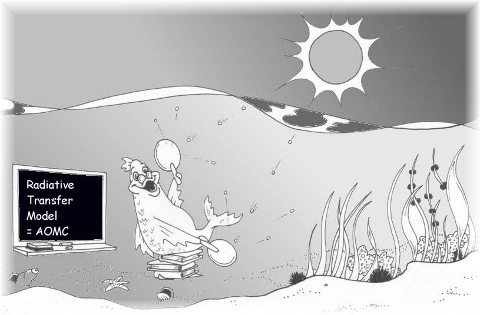

## What is the AOMC model? 

The AOMC model is an Open Source Aquatic Optics Monte Carlo model. It is written in FORTRAN 90. It simulates the propagation of light in an optically shallow, vertically heterogeneous aquatic medium. The model is in continuous development. Some of the routines have been extensively tested while others are still experimental. 

## Model Theory
A detailed description of the radiative transfer theory and the AOMC model's implementation can be found in the [Model Theory document](theory.md).

## What will the model simulate? 

The model simulates radiometric quantities (as measured by radiometers)  such as:
* Upwelling and downwelling scalar and planar irradiances (Euo, Edo, Eu and Ed)
* Radiance
* Mean cosines
* Shape factors (as used in the two-flow or two-stream model)
* Surface Albedo 


## What will the model NOT simulate? 

Currently, the model does not:
* simulate the influence of surface waves (however, this may be implemented in subsequent versions),
* allow for a horizontally variable bottom depth,
* allow for internal light source,
* simulate inelastic scattering (such as Raman scattering).

## What hardware is required to run this model? 

The model will run on any platform that supports a FORTRAN 90 compiler. Intel provides a somewhat free F90 compiler for Linux based PC  systems. This model was written using strict F90 standards. It has been successfully ported (1) to Windows 98 and Windows 2000 using Lahey and Compaq compilers, (2) to Linux OS using Intel’s non-commercial F90 compiler, (3) and SGI using MIPS F90 compiler. 

## Is output graphical? 

No. The software is console (command line) based and the output are data text files. However, the output can easily be imported into a spreadsheet or a favorite graphing program.  

## Has this model appeared in publications?

Yes. The model appears in the following publications:
* Gimond M., 2005. Comprehensive assessment of the two-flow model's shape factors in aquatic environments. Applied Optics, vol. 44, n. 6, pp 966-975.
* Gimond M., 2004. Description and verification of an aquatic optics Monte Carlo model. Environmental Modelling and Software, vol 19, n. 12, pp 1065-1076.

## Is the model free? 
Yes! It follows the Open Source Definition (see https://opensource.org/osd.html) and is available at https://github.com/mgimond/aomc.

## Can I modify the program? 

Of course! The development and improvement of the model is highly encouraged. All that is asked is that proper credit(s) be given where credit is due. 

## Input File Documentation

The AOMC model is configured through a series of plain text input files. Detailed documentation for the format of each file can be found below:

*   [amc.inp](amc_inp_documentation.md): Main model configuration.
*   [abs.inp](abs_inp_documentation.md): Specific absorption coefficients.
*   [scat.inp](scat_inp_documentation.md): Specific scattering coefficients.
*   [conc.inp](conc_inp_documentation.md): Constituent concentrations by layer.
*   [spf.inp](spf_inp_documentation.md): Scattering phase function definitions.
*   [lambbot.inp](lambbot_inp_documentation.md): Wavelength and bottom reflectance properties.
*   [difcol.inp](difcol_inp_documentation.md): Direct vs. diffuse light fractions (used when `lsource=0`).
*   [skydist.inp](skydist_inp_documentation.md): Tabulated sky radiance data (used when `lsource=1`).

## How do I compile the code?

The following instructions explain how to compile the source code using the open-source `gfortran` compiler, which is a common choice for Fortran projects.

### Prerequisites

You must have `gfortran` (or a compatible Fortran 90 compiler) installed. You can check by running:
```sh
gfortran --version
```

### Understanding Dependencies

The source code uses Fortran `MODULE`s to share procedures and data. Files that define modules must be compiled before the files that `USE` them. The module definition files in this project are:
- `global.f90`
- `modules.f90`

### Compilation Steps

The process involves compiling source files (`.f90`) into intermediate object files (`.o`) and then linking them to create the final executable named `aomc`.

1.  **Compile Module Files**:
    This command creates `global.o`, `modules.o`, and the necessary module interface (`.mod`) files.
    ```sh
    gfortran -c global.f90 modules.f90
    ```

2.  **Compile Remaining Source Files**:
    This compiles the rest of the code, which depends on the modules from the previous step.
    ```sh
    gfortran -c geom2.f90 interface.f90 light_internal.f90 logbin.f90 mc.f90 vsf.f90 water.f90
    ```

3.  **Link Object Files**:
    This links all the object files to create the final `aomc` executable.
    ```sh
    gfortran -o aomc *.o
    ```
4. **Clean up**:
    You can clean up the intermediate files with:
    ```sh
    rm *.o *.mod
    ```

## Is there support?

Yes and No. I haven't touched this project since 2003 so support is very limited.
